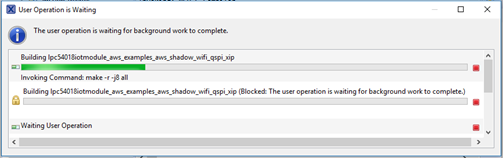
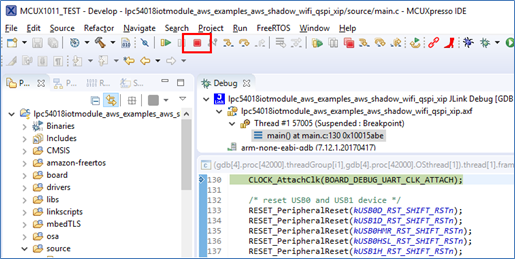

1. Open the MCUXpresso IDE.
2. Open your previously imported “aws_shadow” example project.
3. Select the project folder and click on Build.

    
4. Wait until the project is built.

    
5. Verify the build finished without any errors.

    

6. Connect the IoT Module OM40007 to the IoT baseboard connector P6 and P5
7. Connect the LPC54018 IoT Baseboard Link USB plug J7 to your PC using a micro-USB cable.
8. Program your LPC54018 IoT Module by clicking on “Debug ‘lpc54018iotmodule_aws_examples_aws_shadow_wifi_qspi_xip” from the ‘Quickstart Panel.’

    
9. Select the LPC-LINK2 probe and click *“OK”* to start programming your board.

    
10. Wait until the program is successfully downloaded.

    
11. Stop the debugging session and disconnect the J-Link probe.

    
12. Open the “Device Manager” on your Windows PC.
13.	 Open a Terminal emulator software (TeraTerm, PuTTY or similar) and connect to the COM port using any settings (it’s an USB-Virtual COM port).

    
14.	 Verify that the Shadow of your thing is being updated in AWS IoT.

    