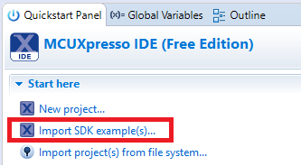
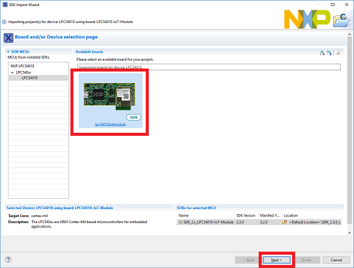
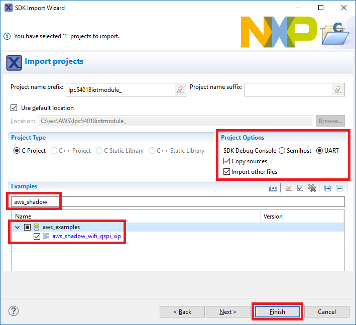
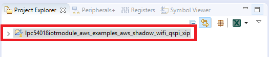

1. Open the MCUXpresso IDE.
2. Click **Import SDK Example(s)** from the QuickStart Panel.

    
3. Select the **lpc54018iotmodule** board in the Import Wizard. Then, select **Next**.

    
4. Type *“aws_shadow”* into the search bar, and select the **“aws_shadow_wifi_qspi_xip”** project under aws_examples. Then, click on **Finish**.

    
5. Verify that project is loaded into the workspace as shown below.

    

 <a href="DebugLinkUART.md">Change terminal to Debug Link UART</a> 
