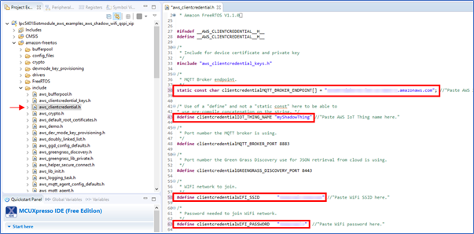
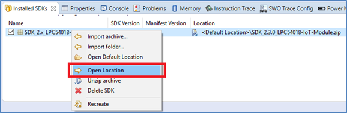
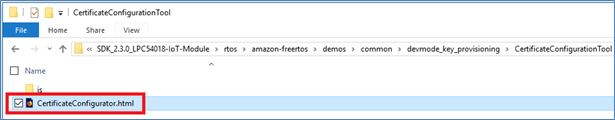
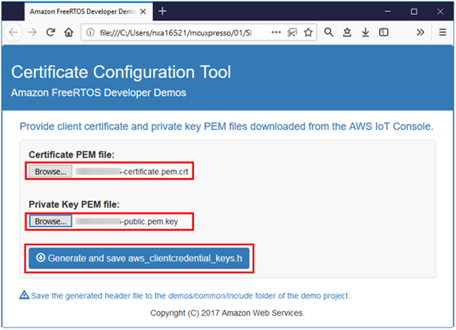

1. Open the MCUXpresso IDE.
2. Open your previously imported “aws_shadow” example project.
3. Locate the file *…/amazon-freertos/include/aws_clientcredential.h* and configure:
     Broker endpoint (Copy the URL from AWS IoT --> ‘myShadowThing’ --> Interact)
     Thing name (“myShadowThing”)
     Wi-Fi SSID
     Wi-Fi Password

    
4. From the SDK folder, locate the Certificate Configurator in the following path:
1*…/SDK_2.3.0_LPC54018-IoT-Module/rtos/amazon-freertos/demos/common/devmode_key_provisioning/CertificateConfigurationTool/CertificateConfigurator.html*

        Note: You can locate your SDK_2.3.0_LPC54018-IoT-Module.zip file by right-clicking on your Installed SDK item and click on “Open Location.”

    
5. Open the CertificateConfigurator file; this tool will generate a "aws_clientcredential_keys.h" header file, based on the certificate files you previously downloaded.

    
6. Browse to the Certificate and Key files you previously downloaded from your Thing (myShadowThing) and click on “Generate and save aws_clientcredential_keys.h”

    

        Note: If no file is downloaded, allow blocked content in the explorer.

7. Copy the newly generated aws_clientcredential_keys.h and replace the one from your aws shadow project. The file is located at:
*…/lpc54018iotmodule_aws_examples_aws_shadow_wifi_qspi_xip\amazon-freertos\include\*

    

 <a href="BuildRunApplication.md">Build and Run your Application</a> 
