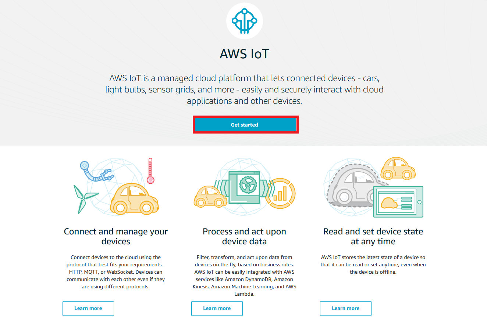
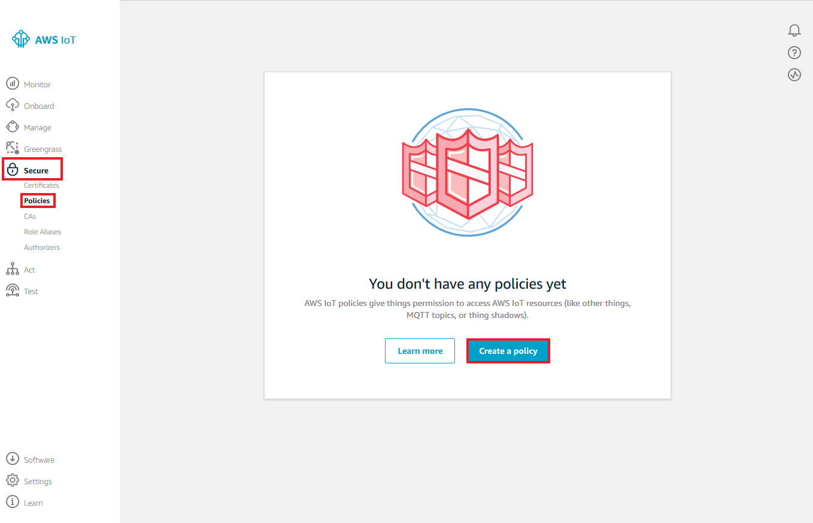
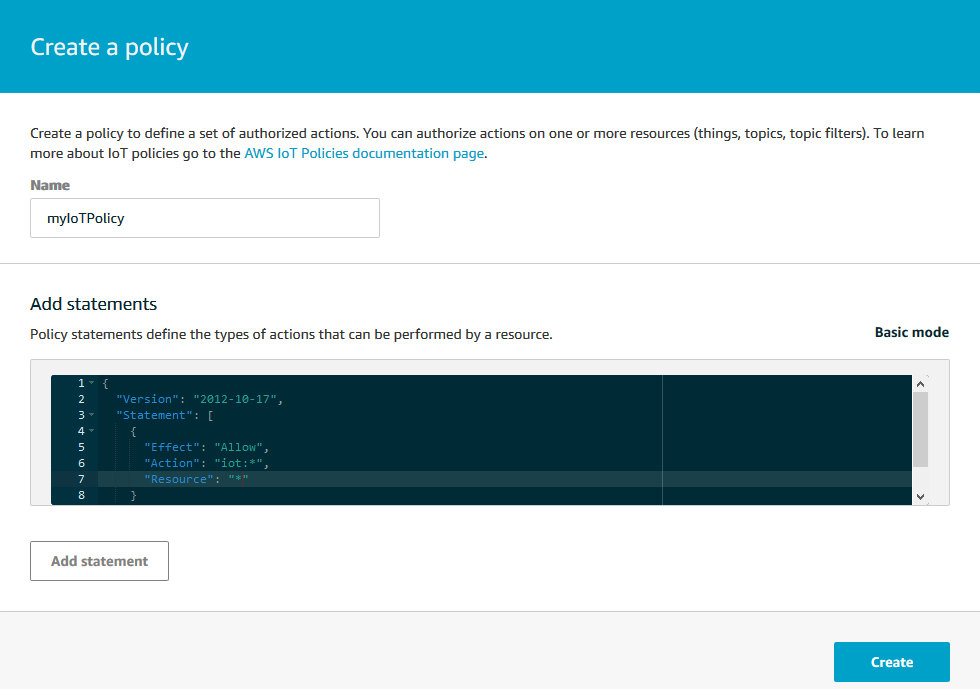
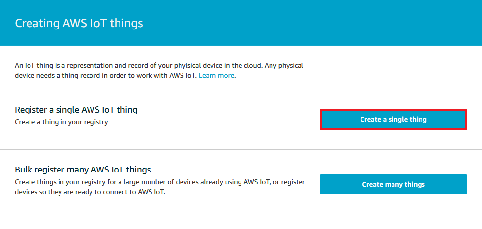
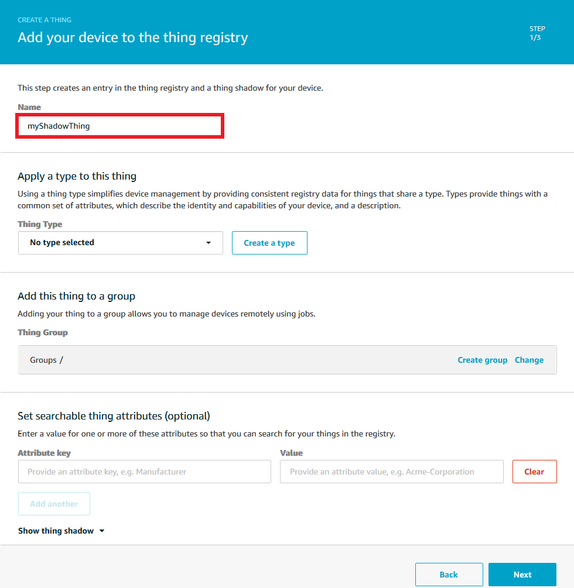
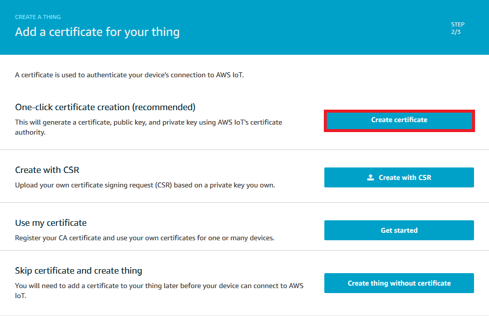
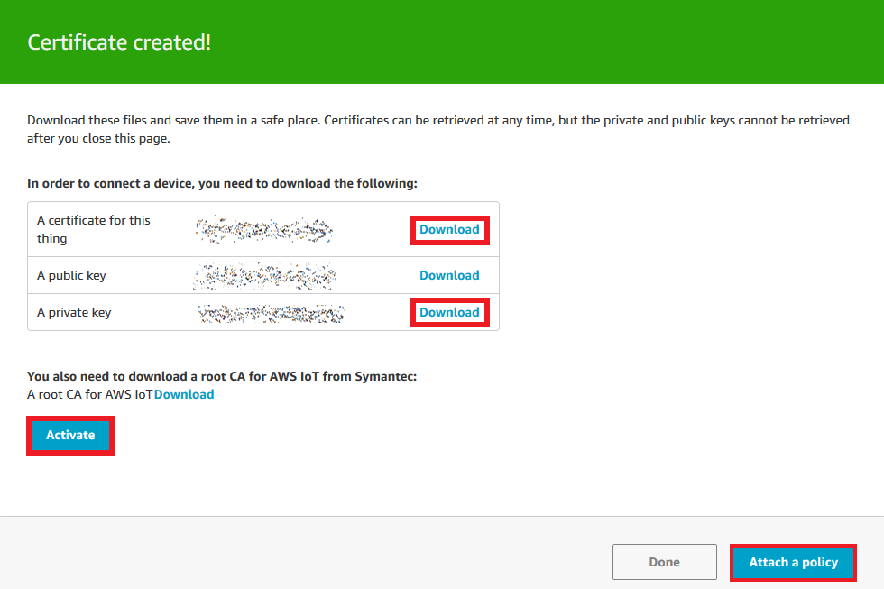

1. Open a web browser and go to AWS IoT console locate at [console.aws.amazon.com/iot](https://console.aws.amazon.com/iot)
2. If this is the first time you access to the AWS IoT console click on **Get started**

    
3. In the left navigation pane, choose **Secure**, and then choose **Policies**. If you do not have any policies registered in your account, the You don't have any policies yet page is displayed. If you see this page, choose to **Create a policy**

    
4. Type *myIoTPolicy* in the Name text box to identify your policy. In the Add statements section, click Advanced mode. Modify lines 5, 6, and 7 with the following content
~~~
{
  "Effect": "Allow",
  "Action": "iot:*",
  "Resource": "*"
}
~~~
Choose **Create**

    
5. In the left navigation pane, choose **Manage**, and then choose **Things**. If you do not have any IoT things registered in your account, the You don't have any things yet page is displayed. If you see this page, choose **Register a thing**. Otherwise, choose to **Create**

    
6. On the Creating AWS IoT things page, choose to **Create a single thing**

    
7. On the Add your device to the thing registry page, type *myShadowThing* in the name text box, then click **Next**

    
8. On the Add a certificate for your thing page, under One-click certificate creation, choose to **Create certificate**

    
9. Download your private key and certificate by choosing the Download links for each. Choose **Activate** to switch on your certificate. Then click **Attach a policy**

    
10. Select the checkbox next to *myIoTPolicy* and choose **Register Thing**

    