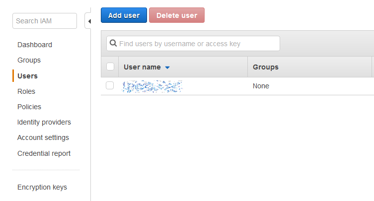
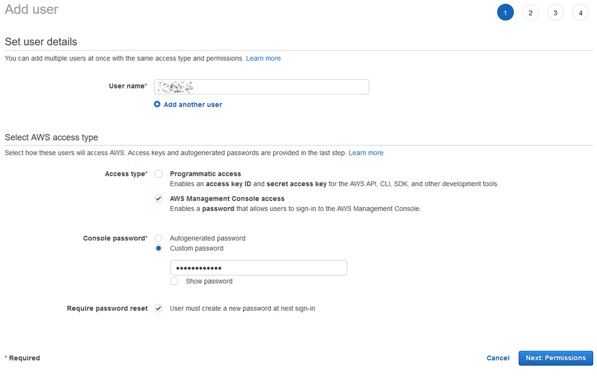
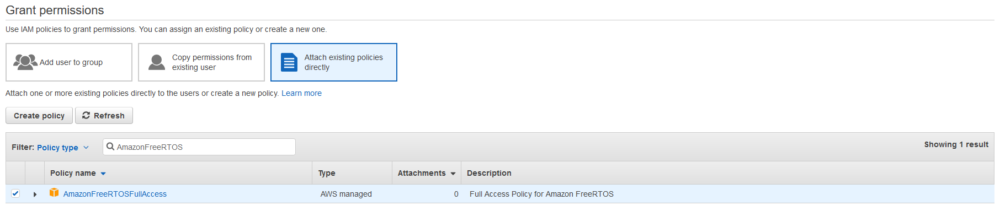
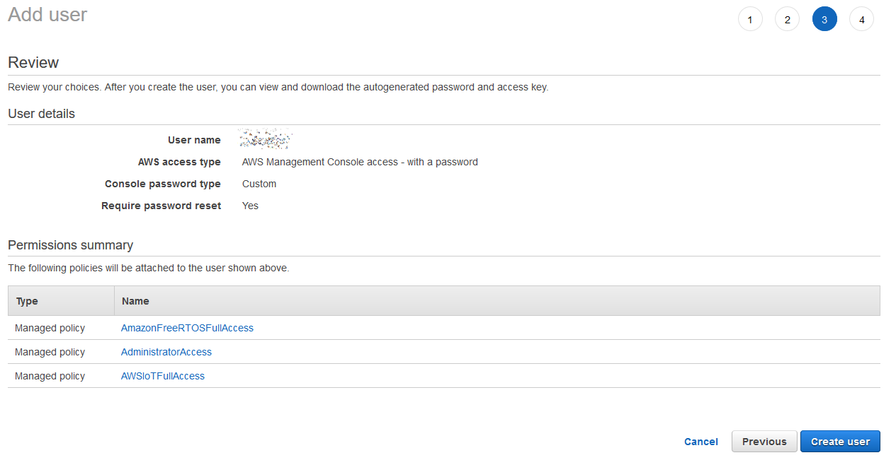
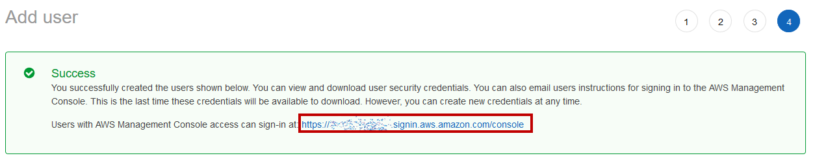

1. Use your AWS root credentials to sign in to the IAM AWS console [console.aws.amazon.com/iam](https://console.aws.amazon.com/iam)
2. In the navigation pane, choose **Users** and then choose **Add user**.

    
3. Type a username, such as Administrator. Select the checkbox next to the **AWS Management Console access**, select **custom password**, and then type your new password in the text box. Click **Next: Permissions**

    
4. Select **Attach existing policies directly** type *“AmazonFreeRTOSFullAccess”* in the search text box, look for the check box button next to the policy name and click it. Then repeat for *“AWSIoTFullAccess,”* and *“AdministratorAccess.”* Finally choose **Next:Review**

    
5. Verify that you have the *AdministratorAccess*, *AmazonFreeRTOSFullAccess* and *AWSIoTFullAccess* policies attached to your account, then click **Create user**

    
6. 	Sign in using the newly created user account and password by clicking on the link next to Users with AWS Management Console access can sign-in at...

    