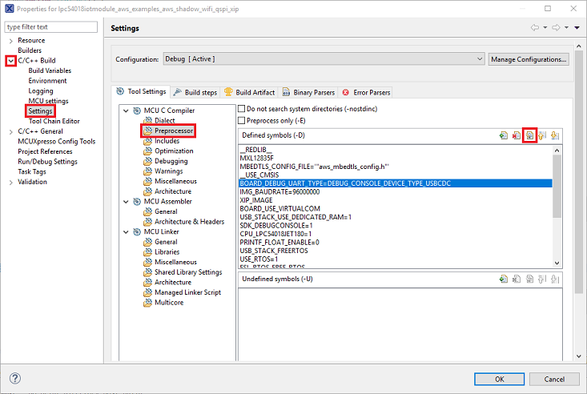
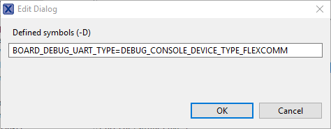
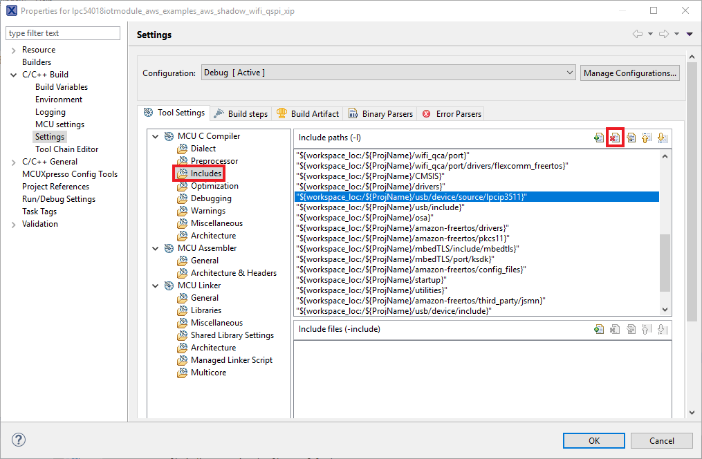
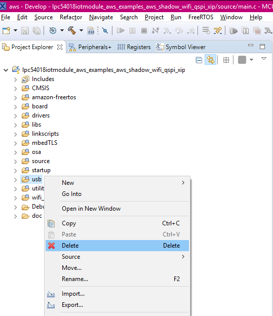
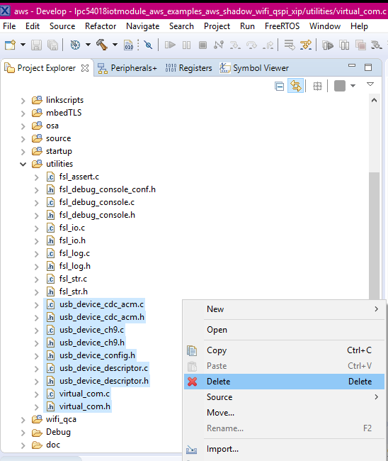

### Change pre-processors
1. Make sure you already import an SDK aws MCUXpresso project
2. In the menu tab select **Project** - **Properties** a new window will pop-up
3. In the Properties window expand the **C/C++ Build menu**, then choose **Settings**. At the Tool Settings tab Click on **Preprocessor**, and look for the *BOARD_DEBUG_UART_TYPE=DEBUG_CONSOLE_DEVICE_TYPE_USBCDC* entry click in the **Edit** icon

    
4. In the Edit dialog equal the defined macro to *DEBUG_CONSOLE_DEVICE_TYPE_FLEXCOMM* then click OK

    
5. With help of the Delete icon  remove the following macros
  ~~~
    BOARD_USE_VIRTUALCOM
    USB_STACK_USE_DEDICATED_RAM=1
    USB_STACK_FREERTOS
    USB_DEVICE_CONFIG_LPCIP3511HS=1
  ~~~
6. Inside the MCU C Compiler tree, choose the **Includes** option. Look for the *"${workspace_loc:/${ProjName}/usb/device/source/lpcip3511}"* path then click remove.

    
7. Repeat the previous step for
  ~~~
    "${workspace_loc:/${ProjName}/usb/include}"
    "${workspace_loc:/${ProjName}/usb/device/include}"
    "${workspace_loc:/${ProjName}/usb/device/source}"
  ~~~
8. Click **OK**. Then choose **No**.

    
9. Back in the MCUXPresso workspace locate the **usb** folder within the **Project Explorer**. Right click the folder, then click **Delete**. Click **OK** on the Delete Resources windows pop-up

    
10. Inside the **utilities** remove the files shown below

    
11. Remove the osa folder
12. In source/main.c comment line #82