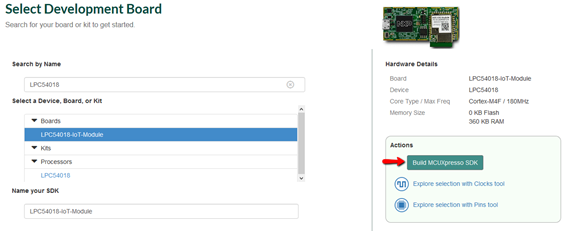

## Pre-Requisites
### Create an AWS account
1. Open the AWS homepage [aws.amazon.com](https://aws.amazon.com)  and choose to **Create a Free Account**
2. Follow the online instructions to create a free account. Part of the sign-up procedure involves:  
        Add payment information, where you will be charged $1.00 USD. No additional charges will apply  
        Receiving a phone call and entering a PIN using your phone's keypad  
3. **Wait up to 24 hours** for your AWS account to be activated

### Download MCUXpresso SDK for the LPC54018 IoT Module SDK
4. Open a web browser and navigate to the [MCUXpresso homepage](http://mcuxpresso.nxp.com)
5. Click on the **Select Development Board** to download and customized a LPC54018 AWS SDK

    
6. After being redirected to [nxp.com](www.nxp.com) login page. Enter your account information or register for a new account.
7. Back on the Select Development Board page search the **LPC54018**. Choose the **LCP54018-IoT Module**, then click **Build MCUXPresso SDK

    
8. At the Select Optional Middleware section, click the + **Add software component**, a window pop-up with a list of components, **Select All** then click **Save Changes**

    
9. Select **Download SDK**

        Note: you may see "Request to Build" instead, so click on that.

10. After the package gets build, there will be new download in the SDK Dashboard section. Look for the receintly created LPC54018-IoT-Module SDK and click in the download icon

    
11. Agree to the Software Terms and Conditions, then **Download SDK Archive & SDK Documentation**

    
### Install MCUXpresso IDE
12. Open [mcuxpresso.nxp.com](www.mcuxpresso.nxp.com)
13. Select **Software and Tools**, then click Learn about MCUXpresso IDE

    
14. Download & Install MCUXpresso IDE

 <a href="CreateandActivateIAMUser.md">Create and Activate IAM User</a> 
